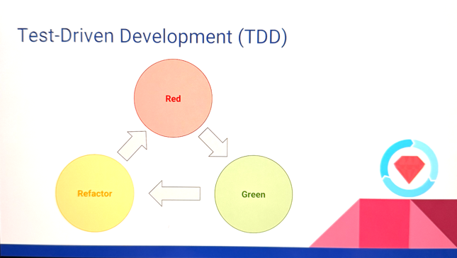

## What is TDD?
* Test Driven Development (TDD) is a software development process that relies on the repetition of a very short development cycle: 
  * First, the developer writes a failing automated test case that defines a desired improvement or new function
  * Then, produces code to pass that test
  * Finally, refactors the new code to acceptable standards

